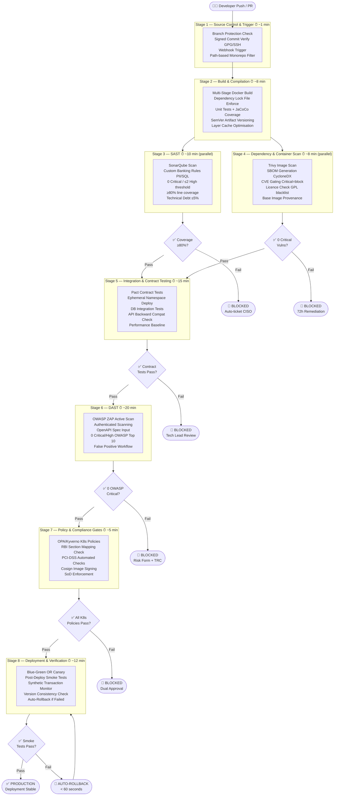

# NovaPay Digital Bank — CI/CD Pipeline Architecture
**Deliverable 1 | 8-Stage Zero-Downtime Pipeline**  
**Author:** Your Name  
**Version:** 1.0  
**Last Updated:** Day 2  

---

## 1. Executive Summary

NovaPay currently deploys via manual SSH with a 4.5-hour MTTR, fortnightly cycles,
and 17 open RBI audit non-conformances. This document defines a production-grade,
eight-stage CI/CD pipeline that reduces commit-to-production time to under 2 hours,
achieves five-nines (99.999%) availability, and enforces automated compliance gates
mapped to RBI Master Direction and PCI-DSS v4.0.

**Key Metrics Targeted:**

| Metric | Current | Target |
|--------|---------|--------|
| Deployment Frequency | Once per 2 weeks | Multiple per day |
| Lead Time for Changes | ~2 weeks | < 2 hours |
| MTTR | 4.5 hours | < 15 minutes |
| Change Failure Rate | Unknown | < 5% |
| Availability | ~99.9% | 99.999% (five-nines) |
| RBI Non-Conformances | 17 open | 0 |

---

## 2. Pipeline Architecture Diagram



---

## 3. Pipeline Stage Summary

| Stage | Name | Tools | SLA Target | Runs |
|-------|------|-------|-----------|------|
| 1 | Source Control & Trigger | GitHub Enterprise, GPG | ~1 min | On every push/PR |
| 2 | Build & Compilation | Gradle, Docker, JaCoCo | ~8 min | Sequential after Stage 1 |
| 3 | SAST | SonarQube | ~10 min | Parallel with Stage 4 |
| 4 | Dependency & Container Scan | Trivy, Syft, FOSSA | ~8 min | Parallel with Stage 3 |
| 5 | Integration & Contract Testing | Pact, Testcontainers | ~15 min | Sequential after 3+4 |
| 6 | DAST | OWASP ZAP | ~20 min | Sequential after Stage 5 |
| 7 | Policy & Compliance Gates | OPA, Kyverno, Cosign | ~5 min | Sequential after Stage 6 |
| 8 | Deployment & Verification | ArgoCD, Istio, Prometheus | ~12 min | Sequential after Stage 7 |
| **Total** | | | **~1h 19min** | **Well under 2h target** |

> **Parallelisation:** Stages 3 and 4 run in parallel, saving ~10 minutes.  
> **Total pipeline time: ~79 minutes** — comfortably under the 2-hour target.

---

## 4. Detailed Stage Specifications

### Stage 1 — Source Control & Trigger

**Purpose:** Enforce code quality controls at the entry point before any compute is spent.

| Parameter | Value |
|-----------|-------|
| Tool | GitHub Enterprise |
| Trigger Events | push to main, pull_request, release tag |
| Branch Strategy | Trunk-Based Development |
| Feature Branch Lifetime | < 24 hours |
| Signed Commits | GPG/SSH mandatory — pipeline rejects unsigned commits |
| Branch Protection | Direct push to main blocked; min 1 reviewer required |
| Monorepo Triggering | Path-based filters — only changed services rebuild |

**Quality Gate:** Unsigned commits → pipeline aborted immediately.  
**SLA:** < 1 minute  
**Failure Mode:** PR blocked, developer notified via GitHub status check.

---

### Stage 2 — Build & Compilation

**Purpose:** Produce a deterministic, versioned, signed container artifact.

| Parameter | Value |
|-----------|-------|
| Build Tool | Gradle 8.x with dependency lock files |
| Docker | Multi-stage build — builder + minimal runtime image |
| Base Image | eclipse-temurin:21-jre-alpine (minimal attack surface) |
| Unit Tests | JUnit 5 + Mockito |
| Coverage Tool | JaCoCo |
| Coverage Threshold | ≥ 80% line coverage, ≥ 70% branch coverage |
| Versioning | SemVer: MAJOR.MINOR.PATCH+GitSHA.BuildID |
| Cache | GitHub Actions cache for Gradle dependencies + Docker layers |
| Artifact Output | Container image pushed to JFrog Artifactory |

**Quality Gate:** Coverage below 80% → pipeline blocked, auto-ticket created.  
**SLA:** < 8 minutes (with cache hit)  
**Failure Mode:** Build fails → developer gets inline PR comment with coverage report.

---

### Stage 3 — Static Analysis & SAST

**Purpose:** Catch security vulnerabilities and code quality issues before runtime.

| Parameter | Value |
|-----------|-------|
| Tool | SonarQube Enterprise with custom banking quality profile |
| Critical Threshold | 0 Critical vulnerabilities allowed |
| High Threshold | ≤ 2 High findings allowed |
| Coverage Gate | ≥ 80% line coverage (enforced here too) |
| Technical Debt | ≤ 5% for new code |
| Custom Rules | PII detection, encryption usage, SQL injection patterns, hardcoded secrets |
| Trend Gating | New issues only — legacy debt tracked separately |
| On Failure | Pipeline blocked + JIRA ticket auto-created + CISO notified |

**Regulatory Mapping:** RBI Section 5.1, PCI-DSS Req 6.2  
**SLA:** < 10 minutes  
**Exception Process:** CISO approval within 24h required to override.

---

### Stage 4 — Dependency & Container Scanning

**Purpose:** Prevent known vulnerable libraries and base images from reaching production.

| Parameter | Value |
|-----------|-------|
| Container Scanner | Trivy (CRITICAL and HIGH severity scan) |
| Dependency Scanner | Grype (for JAR/Maven dependency CVE check) |
| SBOM Tool | Syft — generates CycloneDX format SBOM |
| SBOM Storage | Archived to JFrog Artifactory alongside image |
| CVE Gating | CRITICAL = always block; HIGH = block if CVSS ≥ 8.0 |
| Licence Check | FOSSA — GPL/AGPL/SSPL dependencies trigger legal review |
| Base Image Check | Cosign verifies base image provenance signature |
| On Failure | Pipeline blocked + 72h remediation window + DBA/SecEng notified |

**Regulatory Mapping:** RBI Section 7.2, PCI-DSS Req 6.3  
**SLA:** < 8 minutes  
**Exception Process:** 72-hour remediation window; CISO sign-off for accepted risk.

---

### Stage 5 — Integration & Contract Testing

**Purpose:** Verify services work together and APIs remain backward compatible.

| Parameter | Value |
|-----------|-------|
| Contract Testing | Pact framework — consumer-driven contracts |
| Pact Broker | Self-hosted Pact Broker for contract storage |
| Integration Environment | Ephemeral Kubernetes namespace per PR |
| DB Testing | Testcontainers with PostgreSQL 16 |
| Test Data | Synthetic data only — no production data in staging |
| API Compatibility | OpenAPI diff check — breaking changes block pipeline |
| Performance Baseline | p99 latency < 500ms under 2x load established here |
| On Failure | Pipeline blocked + Tech Lead review required |

**Regulatory Mapping:** RBI Section 4.2  
**SLA:** < 15 minutes  
**Failure Mode:** Contract breach → consumer team notified automatically.

---

### Stage 6 — Dynamic Analysis & DAST

**Purpose:** Test running application for exploitable vulnerabilities.

| Parameter | Value |
|-----------|-------|
| Tool | OWASP ZAP 2.14+ |
| Scan Mode | Active scan (staging) + Passive scan (pre-prod) |
| Authentication | ZAP authenticated scanning with service account credentials |
| API Scanning | OpenAPI/Swagger spec fed to ZAP for full API coverage |
| Threshold | 0 Critical findings, 0 High findings from OWASP Top 10 |
| False Positive | Documented suppression workflow with Tech Lead sign-off |
| On Failure | Pipeline blocked + Risk acceptance form + TRC approval needed |
| Report Format | HTML + JSON — stored in Artifactory for audit trail |

**Regulatory Mapping:** RBI Section 5.1, PCI-DSS Req 6.4, 11.3  
**SLA:** < 20 minutes  
**Exception Process:** Risk acceptance form + TRC panel approval required.

---

### Stage 7 — Policy & Compliance Gates

**Purpose:** Enforce regulatory and infrastructure compliance as code.

| Parameter | Value |
|-----------|-------|
| K8s Policy Engine | OPA (Gatekeeper) + Kyverno |
| IaC Scanning | Checkov for Terraform plans |
| Image Signing | Cosign — all images must be signed before deployment |
| Signature Verification | Kyverno admission controller rejects unsigned images |
| SoD Enforcement | Developer cannot approve their own deployment (RBAC enforced) |
| RBI Checks | Encryption at rest, TLS 1.3, audit logging enabled |
| PCI-DSS Checks | Network segmentation, no plaintext secrets, limits set |
| On Failure | Deployment rejected + dual approval override path |

**Regulatory Mapping:** RBI Sections 4.2, 4.3, 5.4, 6.1, PCI-DSS Req 6.5, 10.2  
**SLA:** < 5 minutes  
**Exception Process:** Dual approval override — Release Manager + CISO.

---

### Stage 8 — Deployment & Verification

**Purpose:** Deploy safely to production and confirm system health automatically.

| Parameter | Value |
|-----------|-------|
| GitOps Tool | ArgoCD 2.x — declarative sync from Git |
| Strategy Selection | Blue-Green (major releases) / Canary (feature releases) |
| Traffic Management | Istio VirtualService for atomic traffic switching |
| Smoke Tests | 15 synthetic transactions post-deploy (payment, balance, UPI) |
| Synthetic Monitoring | Grafana Synthetic Monitoring — runs every 30s |
| Version Check | All pods verified running same container image hash |
| Rollback Trigger | HTTP 5xx > 5% for 60s → auto-rollback < 60 seconds |
| Deployment Windows | Blackout: salary days, month-end, peak hours, festivals |
| On Failure | Category A auto-rollback → SEV-1 incident created |

**Regulatory Mapping:** RBI Sections 4.2, 6.3, PCI-DSS Req 6.5  
**SLA:** < 12 minutes  
**Failure Mode:** Auto-rollback within 60 seconds, on-call paged immediately.

---

## 5. Parallel Execution Strategy

```
Stage 1 (1 min)
    │
Stage 2 (8 min)
    │
    ├──── Stage 3 SAST (10 min) ────┐
    │                                │
    └──── Stage 4 Scan (8 min) ─────┤
                                     │
                              Stage 5 (15 min)
                                     │
                              Stage 6 (20 min)
                                     │
                              Stage 7 (5 min)
                                     │
                              Stage 8 (12 min)
                                     │
                               PRODUCTION ✅

Total Wall Clock Time: ~79 minutes
(Stages 3+4 parallel saves ~8-10 minutes vs sequential)
```

---

## 6. Compliance Mapping Summary

| Pipeline Stage | RBI Section | PCI-DSS Req |
|---------------|------------|------------|
| Stage 1: Source Control | 4.2, 4.3 | 6.5 |
| Stage 2: Build | 4.2 | 6.2 |
| Stage 3: SAST | 5.1 | 6.2, 6.3 |
| Stage 4: Dependency Scan | 7.2 | 6.3 |
| Stage 5: Integration Test | 4.2 | 6.5 |
| Stage 6: DAST | 5.1 | 6.4, 11.3 |
| Stage 7: Compliance Gates | 4.2, 4.3, 5.4, 6.1 | 6.5, 10.2 |
| Stage 8: Deployment | 4.2, 6.3 | 6.5 |

---

## 7. AI Attribution Block

> **AI Tools Used:** Claude (Anthropic) was used to assist in structuring this document,
> generating Mermaid diagram syntax, and drafting stage specification tables.
> All technical decisions, threshold values, tool selections, and regulatory mappings
> were reviewed and validated by the author against RBI Master Direction and
> PCI-DSS v4.0 source documents.
> **Author reviewed and approved:** ✅

---

*Cross-references: See [deployment-strategies](../02-deployment-strategies/) for blue-green
and canary details | See [compliance-gates](../03-compliance-gates/) for gate specifications
| See [rollback-specification](../06-rollback-specification/) for rollback trigger taxonomy*