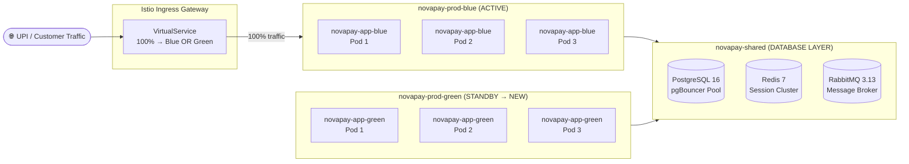
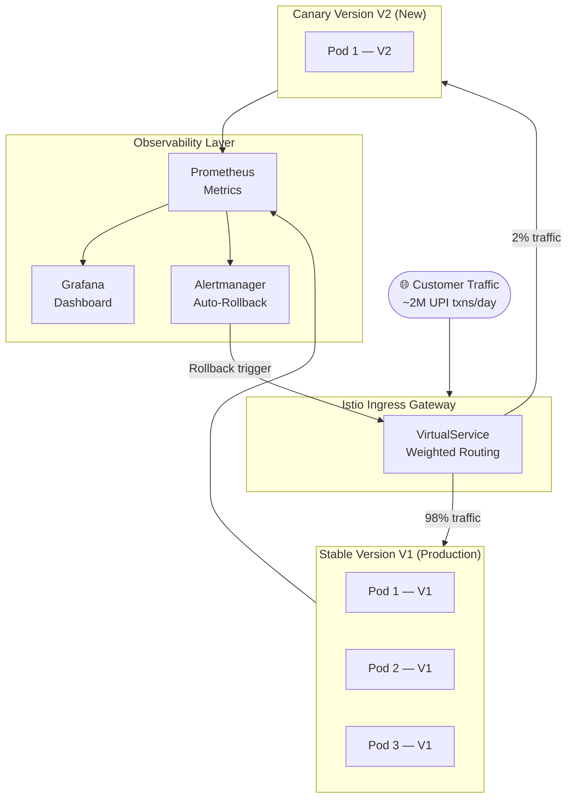

# NovaPay Digital Bank — Deployment Strategies
**Deliverable 2 | Blue-Green + Canary Deployment with Automated Rollback**
**Author:** Your Name | **Version:** 1.0 | **Day:** 4

---

## 1. Overview

NovaPay requires zero-downtime deployments across all services handling UPI
transactions, payment processing, and core banking operations. This document
defines two complementary deployment strategies:

- **Blue-Green:** Used for major releases, infrastructure changes, and
  database schema migrations requiring atomic traffic switching
- **Canary:** Used for feature releases, where progressive traffic shifting
  with statistical validation reduces blast radius

Both strategies are implemented via **Istio VirtualService** on Kubernetes,
managed declaratively through **ArgoCD**, with automated rollback triggered
by **Prometheus alerting rules**.

---

## 2. Blue-Green Deployment

### 2.1 Architecture



### 2.2 Traffic Switching Protocol — 5-Step Sequence

| Step | Action | Tool | Duration | Verification |
|------|--------|------|----------|-------------|
| **1** | Deploy new version to Green namespace | ArgoCD sync | ~5 min | All Green pods Running + Ready |
| **2** | Run smoke tests against Green (internal only) | Custom smoke test suite | ~2 min | 15/15 synthetic transactions pass |
| **3** | Drain Blue connections (stop new requests) | Istio connection draining | 30–60 sec | In-flight requests complete |
| **4** | Switch VirtualService: 100% traffic → Green | `kubectl apply` VirtualService patch | < 5 sec | Atomic switch — no partial state |
| **5** | Monitor Green for 15 minutes | Prometheus + Grafana | 15 min | Error rate < 0.1%, p99 < 200ms |

**Total switching time: < 25 minutes** (zero user-facing downtime)

### 2.3 Istio VirtualService Configuration

```yaml
# pipeline/helm/templates/virtualservice-blue-green.yaml
apiVersion: networking.istio.io/v1alpha3
kind: VirtualService
metadata:
  name: novapay-vs
  namespace: novapay-shared
spec:
  hosts:
    - novapay.in
    - api.novapay.in
  gateways:
    - novapay-gateway
  http:
    - match:
        - uri:
            prefix: /
      route:
        # Switch between blue and green by changing weight values
        # Blue active:  blue=100, green=0
        # Green active: blue=0,   green=100
        - destination:
            host: novapay-app-blue.novapay-prod-blue.svc.cluster.local
            port:
              number: 8080
          weight: 100   # ← Change to 0 when switching to Green
        - destination:
            host: novapay-app-green.novapay-prod-green.svc.cluster.local
            port:
              number: 8080
          weight: 0     # ← Change to 100 when switching to Green
      timeout: 30s
      retries:
        attempts: 3
        perTryTimeout: 10s
        retryOn: gateway-error,connect-failure,retriable-4xx
```

### 2.4 Session Management

NovaPay uses **Redis 7 cluster** for distributed session storage, ensuring
zero session loss during blue-green switches:

```yaml
# application-production.yml (Spring Boot config)
spring:
  session:
    store-type: redis
    redis:
      namespace: novapay:session
  data:
    redis:
      cluster:
        nodes:
          - redis-node-1.novapay-shared:6379
          - redis-node-2.novapay-shared:6379
          - redis-node-3.novapay-shared:6379
      timeout: 2000ms
      lettuce:
        pool:
          max-active: 20
          max-idle: 10
```

**Session behaviour during switch:**
- All active sessions stored in Redis (shared between Blue and Green)
- Green environment reads existing sessions on first request
- Zero session loss — customers mid-transaction are unaffected
- JWT tokens remain valid (shared signing key in Vault)

### 2.5 Long-Running Transaction Handling

Payment processing jobs that span the Blue→Green switch:

| Job Type | Draining Strategy | Timeout |
|----------|------------------|---------|
| HTTP API requests | Istio connection draining | 30–60 seconds |
| UPI payment settlement | Graceful shutdown hook | Up to 5 minutes |
| RabbitMQ consumers | Message acknowledgment drain | Up to 2 minutes |
| Batch reconciliation jobs | Complete current batch | Up to 10 minutes |

```java
// Spring Boot graceful shutdown configuration
// application-production.yml
server:
  shutdown: graceful
spring:
  lifecycle:
    timeout-per-shutdown-phase: 5m  # Allow payment jobs to complete
```

### 2.6 Blue-Green Rollback

If Green fails post-switch — revert VirtualService in < 60 seconds:

```bash
# Emergency rollback script
# pipeline/scripts/bluegreen-rollback.sh

#!/bin/bash
set -e

echo "🚨 BLUE-GREEN ROLLBACK INITIATED — $(date -u)"

# Patch VirtualService to route 100% back to Blue
kubectl patch virtualservice novapay-vs \
  -n novapay-shared \
  --type=json \
  -p='[
    {"op": "replace", "path": "/spec/http/0/route/0/weight", "value": 100},
    {"op": "replace", "path": "/spec/http/0/route/1/weight", "value": 0}
  ]'

echo "✅ Traffic restored to Blue — $(date -u)"

# Create incident record
kubectl create configmap incident-$(date +%s) \
  -n novapay-shared \
  --from-literal=type=blue-green-rollback \
  --from-literal=timestamp="$(date -u)" \
  --from-literal=triggered-by=automated
```

---

## 3. Canary Deployment

### 3.1 Architecture



### 3.2 Canary Progression Table

| Phase | Traffic % | Duration | Success Criteria | Auto Action |
|-------|-----------|----------|-----------------|-------------|
| **Canary** | 1–2% | 15 min | Error rate < 0.1%, p99 latency < 200ms, no critical alerts | Proceed or auto-rollback |
| **Early Adopter** | 5–10% | 30 min | Error rate < 0.05%, p99 < 200ms, no SLO burn | Proceed or auto-rollback |
| **Expansion** | 25–50% | 60 min | All SLOs met, no degradation vs 7-day baseline | Proceed to full rollout |
| **Full Rollout** | 100% | 24 hr bake | Complete SLO compliance for 24 hours | Mark stable |

**Total canary time before full rollout: ~2h 45min minimum**

### 3.3 Statistical Analysis for Canary Promotion

Automated canary promotion uses statistical hypothesis testing to prevent
false positives from promoting a bad build:

#### Latency Comparison — Welch's t-test
```python
# pipeline/scripts/canary-analysis.py

import scipy.stats as stats
import numpy as np

def analyze_canary_latency(stable_p99_samples, canary_p99_samples):
    """
    Welch's t-test for latency comparison.
    Returns True if canary is NOT significantly worse than stable.
    Confidence interval: 95%
    """
    t_stat, p_value = stats.ttest_ind(
        stable_p99_samples,
        canary_p99_samples,
        equal_var=False  # Welch's t-test — does not assume equal variance
    )

    alpha = 0.05  # 95% confidence interval
    canary_mean = np.mean(canary_p99_samples)
    stable_mean = np.mean(stable_p99_samples)
    degradation_pct = ((canary_mean - stable_mean) / stable_mean) * 100

    print(f"Stable p99 mean: {stable_mean:.2f}ms")
    print(f"Canary p99 mean: {canary_mean:.2f}ms")
    print(f"Degradation: {degradation_pct:.2f}%")
    print(f"p-value: {p_value:.4f}")

    # Fail if canary is statistically significantly worse
    if p_value < alpha and canary_mean > stable_mean:
        print(f"❌ CANARY REJECTED: Latency degradation {degradation_pct:.1f}% is statistically significant")
        return False

    print("✅ CANARY LATENCY: Acceptable — promoting to next phase")
    return True


def analyze_error_rate(stable_errors, stable_total, canary_errors, canary_total):
    """
    Chi-squared test for error rate proportional differences.
    """
    from scipy.stats import chi2_contingency

    contingency_table = [
        [stable_errors, stable_total - stable_errors],
        [canary_errors, canary_total - canary_errors]
    ]

    chi2, p_value, dof, expected = chi2_contingency(contingency_table)

    stable_rate = (stable_errors / stable_total) * 100
    canary_rate = (canary_errors / canary_total) * 100

    print(f"Stable error rate: {stable_rate:.3f}%")
    print(f"Canary error rate: {canary_rate:.3f}%")
    print(f"Chi-squared p-value: {p_value:.4f}")

    if p_value < 0.05 and canary_rate > stable_rate:
        print(f"❌ CANARY REJECTED: Error rate increase is statistically significant")
        return False

    print("✅ CANARY ERROR RATE: Acceptable")
    return True
```

#### Multi-Metric Composite Score
```python
def composite_canary_score(latency_ok, error_rate_ok, resource_ok):
    """
    Weighted composite score for canary promotion decision.
    All three must pass for promotion.
    """
    weights = {
        "latency": 0.40,     # 40% weight — most important for UPI
        "error_rate": 0.45,  # 45% weight — critical for banking
        "resource": 0.15     # 15% weight — operational concern
    }

    score = (
        (1 if latency_ok else 0) * weights["latency"] +
        (1 if error_rate_ok else 0) * weights["error_rate"] +
        (1 if resource_ok else 0) * weights["resource"]
    )

    print(f"Composite canary score: {score:.2f}/1.00")

    # Require ALL metrics to pass (score = 1.0) for banking safety
    if score < 1.0:
        print("❌ CANARY FAILED composite score — initiating rollback")
        return False

    print("✅ CANARY PASSED all metrics — promoting")
    return True
```

### 3.4 Istio Canary VirtualService

```yaml
# pipeline/helm/templates/virtualservice-canary.yaml
apiVersion: networking.istio.io/v1alpha3
kind: VirtualService
metadata:
  name: novapay-canary-vs
  namespace: novapay-prod
spec:
  hosts:
    - novapay.in
  gateways:
    - novapay-gateway
  http:
    - match:
        - headers:
            x-canary-user:
              exact: "true"
      route:
        - destination:
            host: novapay-app-canary
            port:
              number: 8080
          weight: 100
    - route:
        - destination:
            host: novapay-app-stable
            port:
              number: 8080
          weight: 98    # ← Adjust per phase: 98→90→75→50→0
        - destination:
            host: novapay-app-canary
            port:
              number: 8080
          weight: 2     # ← Adjust per phase: 2→10→25→50→100
```

---

## 4. Automated Rollback Specification

### 4.1 Category A — Immediate Rollback (< 60 seconds)

These triggers fire automatically with zero human intervention:

| Trigger | Threshold | Detection Method |
|---------|-----------|-----------------|
| HTTP 5xx error rate | > 5% for 60 seconds | Prometheus: `rate(http_requests_total{status=~"5.."}[1m])` |
| Health check failure | 3 consecutive failures | Kubernetes liveness probe |
| OOM Kill detected | Any occurrence | Kubernetes event: `OOMKilled` |
| CrashLoopBackOff | Pod restart count > 3 | Kubernetes pod status watch |
| DB connection exhaustion | Pool usage > 95% | pgBouncer metrics |

```yaml
# pipeline/policies/prometheus-rollback-alerts.yaml
groups:
  - name: novapay.rollback.category-a
    rules:
      - alert: CriticalErrorRateRollback
        expr: |
          rate(http_requests_total{
            namespace="novapay-prod",
            status=~"5.."
          }[1m])
          /
          rate(http_requests_total{namespace="novapay-prod"}[1m])
          * 100 > 5
        for: 1m
        labels:
          severity: critical
          rollback_category: A
          action: immediate_rollback
        annotations:
          summary: "CATEGORY A: HTTP 5xx rate {{ $value }}% — auto-rollback triggered"
          runbook: "https://runbooks.novapay.in/rollback-category-a"

      - alert: DatabaseConnectionExhaustion
        expr: |
          pgbouncer_pools_cl_active{namespace="novapay-prod"}
          /
          pgbouncer_pools_pool_size{namespace="novapay-prod"}
          * 100 > 95
        for: 30s
        labels:
          severity: critical
          rollback_category: A
          action: immediate_rollback
        annotations:
          summary: "CATEGORY A: DB connection pool {{ $value }}% — auto-rollback triggered"
```

### 4.2 Category B — Escalated Rollback (< 15 minutes)

Alert on-call; auto-rollback if no human response within escalation window:

| Trigger | Threshold | Escalation Window |
|---------|-----------|------------------|
| p99 latency degradation | > 2x baseline for 5 min | 10 minutes |
| Error budget burn rate | > 10x normal for 10 min | 15 minutes |
| Transaction success drop | > 2% below baseline | 10 minutes |
| CPU saturation | > 90% sustained 5 min | 15 minutes |
| Memory saturation | > 85% sustained 5 min | 15 minutes |

### 4.3 Category C — Manual Decision

Situations requiring human judgment before rollback:

- Gradual performance degradation below threshold
- Customer support reports not reflected in metrics
- Retroactive compliance failure discovered post-deploy
- Downstream service correlation (not NovaPay's fault)

---

## 5. Deployment Blackout Calendar

No deployments permitted during these windows (enforced in pipeline Stage 8):

| Period | Dates/Times | Reason |
|--------|------------|--------|
| Salary days | 1st, 7th, 15th of month | 3–5x traffic spike |
| Month-end | 28th–31st | Batch reconciliation |
| Diwali | Oct–Nov festival period | Maximum traffic |
| Eid | Per Islamic calendar | High-traffic festival |
| Christmas/New Year | Dec 24–Jan 2 | Elevated transaction volume |
| Holi | Per Hindu calendar | High-traffic festival |
| Peak hours | 10:00–12:00 IST, 17:00–20:00 IST daily | UPI peak windows |
| RBI settlement | As notified by RBI | Regulatory settlement window |

---

## 6. Deployment Velocity Targets

| Metric | Target | How Achieved |
|--------|--------|-------------|
| Commit to production | < 2 hours | Parallel Stage 3+4, optimised DAST |
| Pipeline parallelisation | > 50% | Stages 3 & 4 run simultaneously |
| Developer feedback loop | < 10 minutes | Stages 1+2+3 feedback within 10 min |
| Automated vs manual steps | > 95% | Only pre-prod→prod needs dual approval |
| Rollback execution time | < 2 minutes | VirtualService patch = < 5 sec |

---

## 7. AI Attribution Block

> **AI Tools Used:** Claude (Anthropic) assisted in structuring this document,
> generating Mermaid diagrams, Istio YAML configurations, and Python
> statistical analysis scripts. All deployment thresholds, traffic percentages,
> and rollback triggers were validated against NovaPay's operational requirements
> and RBI Master Direction guidance.
> **Author reviewed and approved:** ✅

---

*Cross-references: [architecture.md](../01-pipeline-architecture/architecture.md) —
Stage 8 detail | [rollback-specification](../06-rollback-specification/) —
full rollback taxonomy | [compliance-gates](../03-compliance-gates/) — gate details*
