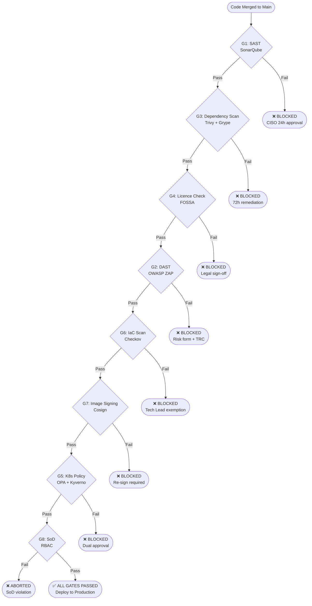
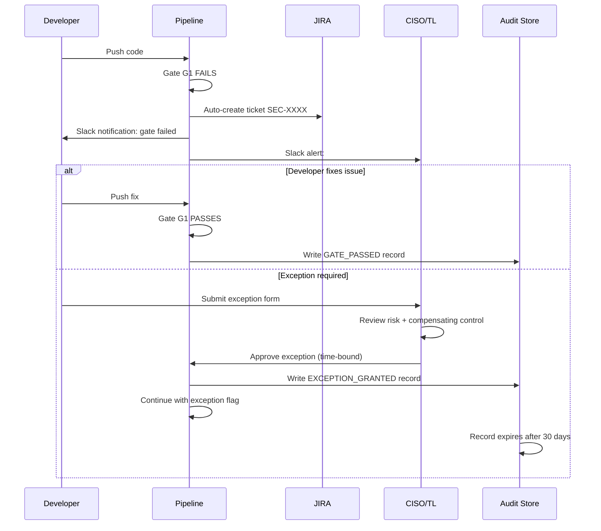

# NovaPay Digital Bank — Compliance Gate Architecture
**Deliverable 3 | 6+ Automated Compliance Gates with RBI & PCI-DSS Mapping**
**Author:** Your Name | **Version:** 1.0 | **Day:** 5

---

## 1. Overview

NovaPay's pipeline enforces **eight automated compliance gates** — two more
than the minimum six required. Each gate is a hard blocking condition:
the pipeline cannot proceed unless the gate passes. There is no silent
failure mode. Every gate produces a structured audit record consumed by
the Regulatory Dashboard (Deliverable 8).

**Core Principle:** Compliance is not a post-deployment checklist.
It is an automated, evidence-generating, pipeline-embedded control that
satisfies RBI Master Direction Section 6.1 (comprehensive audit trails)
by producing machine-readable compliance evidence for every single
code change that reaches production.

---

## 2. Compliance Gate Summary

| # | Gate | Tool | Threshold | On Failure | RBI | PCI-DSS |
|---|------|------|-----------|-----------|-----|---------|
| G1 | SAST | SonarQube | 0 Critical, ≤2 High, ≥80% coverage | Pipeline blocked + auto-ticket | 5.1 | 6.2, 6.3 |
| G2 | DAST | OWASP ZAP | 0 Critical, 0 High (OWASP Top 10) | Pipeline blocked | 5.1 | 6.4, 11.3 |
| G3 | Dependency Scan | Trivy + Grype | 0 Critical CVE, SBOM generated | Pipeline blocked if CVSS ≥ 9.0 | 7.2 | 6.3 |
| G4 | Licence Compliance | FOSSA | No GPL/AGPL/SSPL | Legal review triggered | 7.2 | — |
| G5 | K8s Policy | OPA/Kyverno | All 7 policies pass | Deployment rejected | 4.2, 5.4 | 6.5 |
| G6 | IaC Scan | Checkov | No privileged containers, limits set | PR blocked | 4.2 | 6.5 |
| G7 | Image Signing | Cosign | Valid Cosign signature present | Deployment rejected | 7.2 | — |
| G8 | Segregation of Duties | RBAC + GitHub | Author ≠ Approver | Pipeline aborted | 4.3 | 6.5 |

---

## 3. Gate Detailed Specifications

### G1 — SAST Gate (SonarQube)

**Regulatory Mapping:** RBI Section 5.1, PCI-DSS Req 6.2, 6.3

| Parameter | Value |
|-----------|-------|
| Tool | SonarQube Enterprise |
| Quality Profile | NovaPay Banking Profile (custom) |
| Critical Threshold | **0 Critical** — any critical blocks pipeline |
| High Threshold | **≤ 2 High** — more than 2 blocks pipeline |
| Coverage Threshold | **≥ 80% line coverage, ≥ 70% branch coverage** |
| Technical Debt | ≤ 5% for new code introduced in this PR |
| Custom Rules | PII exposure, hardcoded credentials, SQL injection, insecure encryption |
| Trend Gate | Blocks if new issues introduced (not pre-existing debt) |
| Report Format | JSON + HTML stored in Artifactory |
| Audit Trail | Gate result + timestamp + approver logged to immutable store |

**Pass Criteria:**
```
sonarqube_quality_gate_status == "OK"
AND critical_issues == 0
AND high_issues <= 2
AND line_coverage >= 80
AND branch_coverage >= 70
```

**On Failure:**
1. Pipeline blocked immediately
2. JIRA ticket auto-created and assigned to developer
3. CISO notified via Slack `#security-alerts`
4. Compliance record written: `GATE_FAILED: SAST`

**Exception Process:**
- CISO approval required within **24 hours**
- Exception form documents: vulnerability description, risk acceptance rationale,
  compensating control, expiry date (max 30 days)
- Exception logged in audit trail with approver identity

---

### G2 — DAST Gate (OWASP ZAP)

**Regulatory Mapping:** RBI Section 5.1, PCI-DSS Req 6.4, 11.3

| Parameter | Value |
|-----------|-------|
| Tool | OWASP ZAP 2.14+ |
| Scan Type | Active scan in staging + Passive scan in pre-prod |
| Authentication | Form-based auth with dedicated ZAP service account |
| API Coverage | Full OpenAPI/Swagger spec ingested |
| Critical Threshold | **0 Critical findings** from OWASP Top 10 |
| High Threshold | **0 High findings** from OWASP Top 10 |
| OWASP Top 10 Categories | A01–A10 all checked |
| False Positive Workflow | Tech Lead sign-off required to suppress any finding |
| Report Format | HTML + JSON archived with pipeline run ID |

**OWASP Top 10 Coverage Checklist:**

| OWASP ID | Category | ZAP Rule | Threshold |
|----------|----------|----------|-----------|
| A01 | Broken Access Control | Access control testing | 0 Critical/High |
| A02 | Cryptographic Failures | SSL/TLS checks | 0 Critical/High |
| A03 | Injection | SQL/Command injection scan | 0 Critical/High |
| A04 | Insecure Design | Business logic testing | 0 Critical/High |
| A05 | Security Misconfiguration | Header analysis | 0 Critical/High |
| A06 | Vulnerable Components | Integration with Trivy results | 0 Critical/High |
| A07 | Auth Failures | Session management testing | 0 Critical/High |
| A08 | Data Integrity Failures | Deserialization checks | 0 Critical/High |
| A09 | Logging Failures | Error message analysis | 0 Critical/High |
| A10 | SSRF | Server-side request testing | 0 Critical/High |

**Exception Process:**
- Risk acceptance form completed by CISO
- TRC panel approval required (cannot be bypassed by CISO alone)
- Maximum exception duration: 72 hours
- Compensating control must be documented

---

### G3 — Dependency & Container Scanning Gate (Trivy)

**Regulatory Mapping:** RBI Section 7.2, PCI-DSS Req 6.3

| Parameter | Value |
|-----------|-------|
| Container Scanner | Trivy (Aqua Security) |
| Dependency Scanner | Grype (Anchore) |
| SBOM Tool | Syft — CycloneDX JSON format |
| Critical CVE Threshold | **0 Critical CVEs** — always blocks |
| High CVE Threshold | **Block if CVSS ≥ 8.0** |
| SBOM Requirement | SBOM must be generated and archived before gate passes |
| Base Image Check | Cosign verifies base image is from approved publisher |
| Update Frequency | CVE database updated every 6 hours in CI runner |

**CVE Severity Mapping:**

| CVSS Score | Severity | Action |
|-----------|----------|--------|
| 9.0–10.0 | Critical | **Hard block — no exceptions** |
| 8.0–8.9 | High (CVSS ≥ 8.0) | **Hard block** |
| 7.0–7.9 | High (CVSS < 8.0) | Warning — tracked, not blocking |
| 4.0–6.9 | Medium | Warning — remediate within 30 days |
| 0.1–3.9 | Low | Logged only |

**Exception Process:**
- 72-hour remediation window granted
- CISO notified immediately on block
- If no fix available: vendor advisory required + compensating control

---

### G4 — Licence Compliance Gate (FOSSA)

**Regulatory Mapping:** RBI Section 7.2 (third-party risk management)

| Parameter | Value |
|-----------|-------|
| Tool | FOSSA (or Scancode Toolkit as open-source alternative) |
| Blocked Licences | GPL v2/v3, AGPL, SSPL, EUPL (copyleft — legal risk) |
| Allowed Licences | MIT, Apache 2.0, BSD 2/3-clause, ISC, MPL 2.0 |
| Scope | All direct and transitive dependencies |
| New Dependency Check | Any new library addition triggers full licence scan |

**Licence Risk Matrix:**

| Licence Type | Risk Level | Action |
|-------------|-----------|--------|
| GPL v2/v3 | 🔴 HIGH | Hard block — legal review required |
| AGPL | 🔴 HIGH | Hard block — incompatible with proprietary banking software |
| SSPL | 🔴 HIGH | Hard block — MongoDB variant, broad copyleft |
| LGPL | 🟡 MEDIUM | Warning — Tech Lead + Legal review |
| MPL 2.0 | 🟢 LOW | Allowed with file-level isolation |
| Apache 2.0 | 🟢 SAFE | Fully permitted |
| MIT / BSD | 🟢 SAFE | Fully permitted |

**Exception Process:**
- Legal team sign-off mandatory (cannot be waived by engineering)
- Alternative library investigation required before exception granted
- Exception logged with legal counsel name and reference number

---

### G5 — Kubernetes Policy Gate (OPA/Kyverno)

**Regulatory Mapping:** RBI Sections 4.2, 5.4, PCI-DSS Req 6.5

All 7 OPA policies defined in `pipeline/policies/novapay-compliance.rego`
must pass. See that file for full policy definitions.

| Policy | Description | RBI/PCI |
|--------|-------------|---------|
| P1 | No privileged containers | RBI 5.4 |
| P2 | Resource limits mandatory | RBI 6.3 |
| P3 | Security context required (runAsNonRoot) | RBI 5.4 |
| P4 | Authorized registry only | RBI 7.2 |
| P5 | No plaintext secrets in env vars | RBI 5.4, PCI 10.2 |
| P6 | NetworkPolicy label on prod namespaces | RBI 5.4 |
| P7 | No 'latest' image tags | RBI 6.1 |

**Exception Process:**
- Dual approval override: Release Manager AND CISO both must approve
- Exception window: maximum 4 hours
- Root cause and fix timeline documented

---

### G6 — Infrastructure as Code Scanning Gate (Checkov)

**Regulatory Mapping:** RBI Section 4.2, PCI-DSS Req 6.5

| Parameter | Value |
|-----------|-------|
| Tool | Checkov (Bridgecrew) |
| Scope | All Terraform plans + Kubernetes manifests |
| Hard Checks | CKV_K8S_6 (no privileged), CKV_K8S_8 (liveness probe), CKV_K8S_9 (readiness probe) |
| Encryption Checks | CKV_AWS_19 (S3 encryption), CKV_AWS_86 (RDS encryption at rest) |
| Network Checks | CKV_AWS_25 (SG no open ports), CKV_AWS_24 (SG SSH restricted) |
| On Failure | PR blocked — cannot merge until fixed |

**Exception Process:**
- Tech Lead exemption (single approver sufficient for IaC)
- Exemption documented in `.checkov.yaml` with justification comment
- Maximum exemption: 14 days before mandatory remediation

---

### G7 — Image Signing Gate (Cosign)

**Regulatory Mapping:** RBI Section 7.2 (supply chain security)

| Parameter | Value |
|-----------|-------|
| Tool | Cosign (Sigstore) |
| Key Type | ECDSA P-256 — stored in HashiCorp Vault |
| Signing Point | After Stage 4 scan passes — before Stage 5 integration test |
| Verification Point | Kyverno admission controller in production cluster |
| Unsigned Image Behaviour | Kyverno rejects Pod admission — deployment fails |
| Key Rotation | Every 90 days (automated via Vault) |

```yaml
# Kyverno policy — enforce signed images
# pipeline/policies/kyverno-image-signing.yaml
apiVersion: kyverno.io/v1
kind: ClusterPolicy
metadata:
  name: novapay-require-signed-images
  annotations:
    policies.kyverno.io/description: >
      All NovaPay production container images must be signed with Cosign.
      Unsigned images are rejected at admission. RBI Section 7.2 compliance.
spec:
  validationFailureAction: enforce
  background: false
  rules:
    - name: verify-image-signature
      match:
        any:
          - resources:
              kinds:
                - Pod
              namespaces:
                - novapay-prod-blue
                - novapay-prod-green
      verifyImages:
        - imageReferences:
            - "novapay.jfrog.io/*"
          attestors:
            - count: 1
              entries:
                - keys:
                    publicKeys: |-
                      -----BEGIN PUBLIC KEY-----
                      # NovaPay Cosign Public Key (rotate every 90 days)
                      # Stored in HashiCorp Vault: secret/novapay/cosign/public-key
                      -----END PUBLIC KEY-----
```

---

### G8 — Segregation of Duties Gate (RBAC)

**Regulatory Mapping:** RBI Section 4.3

| Parameter | Value |
|-----------|-------|
| Enforcement | GitHub branch protection + RBAC |
| Rule | Code author CANNOT approve their own PR |
| Rule | Developer CANNOT trigger production deployment |
| Deployment Role | Only `release-manager` and `sre-lead` roles can approve production |
| Audit | Every approval logged with approver identity + timestamp |

**RBAC Role Matrix:**

| Role | Can Write Code | Can Approve PR | Can Deploy Staging | Can Deploy Production |
|------|---------------|---------------|-------------------|----------------------|
| developer | ✅ | ✅ (others' PRs) | ✅ (auto) | ❌ |
| tech-lead | ✅ | ✅ | ✅ | ❌ |
| sre-engineer | ❌ | ✅ | ✅ | ✅ (with RM) |
| release-manager | ❌ | ✅ | ✅ | ✅ (with SRE Lead) |
| ciso | ❌ | ❌ | ❌ | Exception override only |

---

## 4. Gate Orchestration Diagram



---

## 5. Audit Trail Schema

Every gate produces a structured JSON record written to the immutable
audit store (S3 with Object Lock / Artifactory with immutable repository):

```json
{
  "audit_record_id": "uuid-v4",
  "pipeline_run_id": "github-run-12345",
  "commit_sha": "abc123def456",
  "timestamp_utc": "2025-01-15T14:32:00Z",
  "gate_id": "G1",
  "gate_name": "SAST",
  "tool": "SonarQube",
  "tool_version": "9.9.4",
  "result": "PASSED",
  "thresholds": {
    "critical_issues": {"threshold": 0, "actual": 0},
    "high_issues": {"threshold": 2, "actual": 1},
    "line_coverage": {"threshold": 80, "actual": 84.2},
    "branch_coverage": {"threshold": 70, "actual": 72.8}
  },
  "regulatory_mapping": {
    "rbi_sections": ["5.1"],
    "pci_dss_requirements": ["6.2", "6.3"]
  },
  "approver": null,
  "exception_granted": false,
  "retention_period_years": 7
}
```

**Retention Policy:** All audit records retained for **7 years** per RBI
data retention requirements. Records are write-once, read-many (WORM)
using S3 Object Lock in Compliance mode.

---

## 6. Exception Workflow



---

## 7. AI Attribution Block

> **AI Tools Used:** Claude (Anthropic) assisted in structuring compliance
> gate specifications, generating Mermaid diagrams, Kyverno YAML policies,
> and the audit trail JSON schema. All regulatory mappings to RBI Master
> Direction sections and PCI-DSS v4.0 requirements were validated against
> the source regulatory documents by the author.
> **Author reviewed and approved:** ✅

---

*Cross-references: [architecture.md](../01-pipeline-architecture/architecture.md) —
Stages 3, 4, 6, 7 | [novapay-compliance.rego](../../pipeline/policies/novapay-compliance.rego)
— OPA policy implementations | [rollback-specification](../06-rollback-specification/) —
post-gate failure handling*
