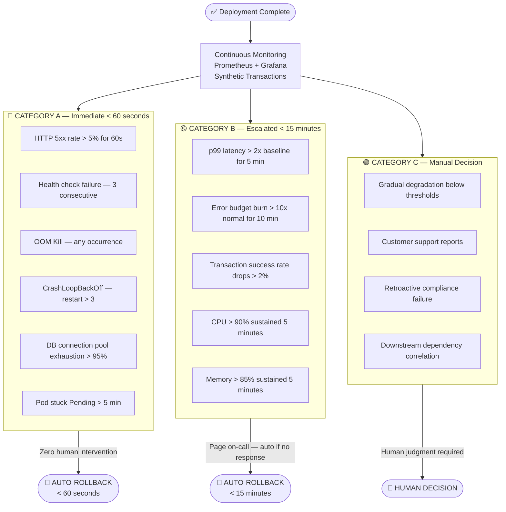
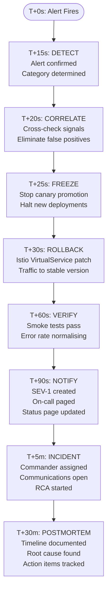

# NovaPay Digital Bank — Automated Rollback Specification
**Deliverable 6 | Three-Category Rollback Trigger Taxonomy**
**Author:** Your Name | **Version:** 1.0 | **Day:** 8

---

## 1. Overview

Automated rollback is the safety net that makes rapid deployment possible
at NovaPay. Without it, deploying multiple times per day would be
irresponsible in a banking context where a single bad deployment can
freeze UPI payments for millions of customers and trigger RBI scrutiny.

This document defines three categories of rollback triggers, an
eight-step rollback execution workflow, and the post-rollback
verification procedure required before resuming normal operations.

**Rollback Design Principles:**
- Rollback systems must be independent of the primary deployment path
- If a deployment breaks the rollback mechanism, out-of-band recovery must be available
- All rollback events are logged immutably (RBI Section 6.1)
- Rollback must complete within SLA before a SEV-1 incident is declared

---

## 2. Rollback Trigger Taxonomy



---

## 3. Category A — Immediate Rollback (< 60 seconds)

| Trigger ID | Metric | Threshold | Detection Window | Action |
|-----------|--------|-----------|-----------------|--------|
| A1 | HTTP 5xx error rate | > 5% | 60 seconds | Instant rollback |
| A2 | Health check failures | 3 consecutive | Per probe interval | Instant rollback |
| A3 | OOM Kill | Any occurrence | Event stream | Instant rollback |
| A4 | CrashLoopBackOff | Restart count > 3 | Pod status watch | Instant rollback |
| A5 | DB connection pool | > 95% utilisation | 30 seconds | Instant rollback |
| A6 | Pod pending | Stuck > 5 minutes | Pod status watch | Alert + rollback |

### Prometheus Alerting Rules — Category A

```yaml
# pipeline/policies/prometheus-rollback-alerts.yaml
groups:
  - name: novapay.rollback.category-a
    interval: 15s

    rules:
      - alert: CriticalErrorRateRollback
        expr: |
          (
            rate(http_server_requests_seconds_count{
              namespace=~"novapay-prod.*",
              status=~"5.."
            }[1m])
            /
            rate(http_server_requests_seconds_count{
              namespace=~"novapay-prod.*"
            }[1m])
          ) * 100 > 5
        for: 1m
        labels:
          severity: critical
          rollback_category: "A"
          action: immediate_rollback
        annotations:
          summary: "CATEGORY A ROLLBACK: HTTP 5xx rate {{ $value }}%"
          description: >
            Error rate {{ $value }}% exceeds 5% threshold for 60s.
            Auto-rollback initiated. No human action required.
          runbook_url: "https://runbooks.novapay.in/rollback/category-a"

      - alert: OOMKillRollback
        expr: |
          kube_pod_container_status_last_terminated_reason{
            namespace=~"novapay-prod.*",
            reason="OOMKilled"
          } == 1
        for: 0s
        labels:
          severity: critical
          rollback_category: "A"
          action: immediate_rollback
        annotations:
          summary: "CATEGORY A ROLLBACK: OOM Kill detected in {{ $labels.pod }}"

      - alert: CrashLoopBackOffRollback
        expr: |
          kube_pod_container_status_restarts_total{
            namespace=~"novapay-prod.*",
            container="novapay-app"
          } > 3
        for: 0s
        labels:
          severity: critical
          rollback_category: "A"
          action: immediate_rollback
        annotations:
          summary: "CATEGORY A ROLLBACK: CrashLoopBackOff — {{ $labels.pod }}"

      - alert: DatabaseConnectionExhaustionRollback
        expr: |
          (
            pgbouncer_pools_cl_active{namespace=~"novapay-prod.*"}
            /
            pgbouncer_pools_pool_size{namespace=~"novapay-prod.*"}
          ) * 100 > 95
        for: 30s
        labels:
          severity: critical
          rollback_category: "A"
          action: immediate_rollback
        annotations:
          summary: "CATEGORY A ROLLBACK: DB pool {{ $value }}% exhausted"

  - name: novapay.rollback.category-b
    interval: 30s

    rules:
      - alert: LatencyDegradationEscalated
        expr: |
          histogram_quantile(0.99,
            rate(http_server_requests_seconds_bucket{
              namespace=~"novapay-prod.*"
            }[5m])
          )
          /
          histogram_quantile(0.99,
            rate(http_server_requests_seconds_bucket{
              namespace=~"novapay-prod.*"
            }[1h] offset 1h)
          ) > 2
        for: 5m
        labels:
          severity: warning
          rollback_category: "B"
          action: escalate_and_auto_rollback
        annotations:
          summary: "CATEGORY B: p99 latency {{ $value }}x baseline — escalating"

      - alert: TransactionSuccessRateDrop
        expr: |
          (
            rate(payment_transactions_total{
              namespace=~"novapay-prod.*",
              status="success"
            }[5m])
            /
            rate(payment_transactions_total{
              namespace=~"novapay-prod.*"
            }[5m])
          ) * 100 < 98
        for: 5m
        labels:
          severity: warning
          rollback_category: "B"
          action: escalate_and_auto_rollback
        annotations:
          summary: "CATEGORY B: Payment success rate {{ $value }}% — below 98%"

      - alert: CPUSaturationEscalated
        expr: |
          rate(container_cpu_usage_seconds_total{
            namespace=~"novapay-prod.*",
            container="novapay-app"
          }[5m]) * 100 > 90
        for: 5m
        labels:
          severity: warning
          rollback_category: "B"
        annotations:
          summary: "CATEGORY B: CPU {{ $value }}% sustained 5 minutes"

      - alert: MemorySaturationEscalated
        expr: |
          (
            container_memory_working_set_bytes{
              namespace=~"novapay-prod.*",
              container="novapay-app"
            }
            /
            container_spec_memory_limit_bytes{
              namespace=~"novapay-prod.*",
              container="novapay-app"
            }
          ) * 100 > 85
        for: 5m
        labels:
          severity: warning
          rollback_category: "B"
        annotations:
          summary: "CATEGORY B: Memory {{ $value }}% sustained 5 minutes"
```

---

## 4. Eight-Step Rollback Execution Workflow



### Rollback Execution Script

```bash
#!/bin/bash
# pipeline/scripts/rollback-controller.sh
# Independent of ArgoCD — works even if ArgoCD is unavailable
set -e

ALERT_NAME="$1"
ROLLBACK_CATEGORY="$2"
NAMESPACE="${3:-novapay-prod-blue}"

echo "$(date -u) | ROLLBACK TRIGGERED | Alert: ${ALERT_NAME} | Category: ${ROLLBACK_CATEGORY}"

# STEP 1 — Log to immutable audit store (RBI 6.1)
curl -sX POST "${AUDIT_STORE_URL}/rollback-events" \
  -H "Content-Type: application/json" \
  -d "{
    \"timestamp\": \"$(date -u +%Y-%m-%dT%H:%M:%SZ)\",
    \"alert\": \"${ALERT_NAME}\",
    \"category\": \"${ROLLBACK_CATEGORY}\",
    \"namespace\": \"${NAMESPACE}\",
    \"triggered_by\": \"automated\"
  }"

# STEP 2 — Freeze any in-progress canary promotion
kubectl annotate deployment novapay-app-canary \
  -n "${NAMESPACE}" \
  "novapay.io/rollback-freeze=true" --overwrite 2>/dev/null || true

argocd app terminate-op novapay-production \
  --server "${ARGOCD_SERVER}" \
  --auth-token "${ARGOCD_TOKEN}" 2>/dev/null || true

echo "Pipeline frozen."

# STEP 3 — Atomic traffic switch via Istio VirtualService
PREVIOUS_VERSION=$(kubectl get configmap deployment-history \
  -n novapay-shared \
  -o jsonpath='{.data.previous_stable_version}')

echo "Rolling back to: ${PREVIOUS_VERSION}"

kubectl patch virtualservice novapay-vs \
  -n novapay-shared \
  --type=json \
  -p='[
    {"op": "replace", "path": "/spec/http/0/route/0/weight", "value": 100},
    {"op": "replace", "path": "/spec/http/0/route/1/weight", "value": 0}
  ]'

echo "$(date -u) | Traffic restored to ${PREVIOUS_VERSION}"

# STEP 4 — Verify recovery
sleep 30
./pipeline/scripts/smoke-tests.sh \
  --env production \
  --timeout 30 \
  --tests "health,payment-flow,upi-transfer"

# STEP 5 — Notify stakeholders
curl -sX POST "${SLACK_WEBHOOK}" \
  -d "{\"text\": \"🚨 SEV-1: Auto-rollback triggered. Alert: ${ALERT_NAME}. Previous version restored. On-call paged.\"}"

echo "Rollback complete. Incident bridge: ${INCIDENT_BRIDGE_URL}"
```

---

## 5. Post-Rollback Verification Checklist

```yaml
post_rollback_verification:

  smoke_tests:
    - payment_flow:           "Complete UPI payment end-to-end ✅"
    - balance_check:          "Account balance retrieval ✅"
    - authentication:         "Login and token refresh ✅"
    - health_endpoints:       "All /actuator/health checks green ✅"
    - synthetic_transactions: "15/15 synthetic transactions succeed ✅"

  metric_thresholds:
    - error_rate:             "< 0.1% (back to pre-deployment baseline)"
    - p99_latency:            "< 200ms (back to baseline)"
    - transaction_success:    "> 99.9% (back to baseline)"
    - db_connections:         "< 50% pool utilisation"

  customer_impact:
    - identify_failed_txns:   "Flag any UPI transactions that failed during incident"
    - count_affected_users:   "Total users who experienced errors"
    - reconciliation_needed:  "Flag payments needing manual reconciliation"
    - rbi_notification:       "If outage > 30 min — notify RBI per IT Direction 6.3"

  deployment_freeze:
    duration:                 "Until post-mortem complete and root cause identified"
    resume_approval:          "CTO + CISO sign-off required before next deployment"
```

---

## 6. RBI Notification Requirements

Per RBI Master Direction Section 6.3, NovaPay must notify RBI if a
technology incident affects payment processing for more than 30 minutes:

| Timeline | Action |
|----------|--------|
| T+30 min | Initial RBI notification (if unresolved) |
| T+2 hours | Detailed impact report submitted |
| T+7 days | Full post-mortem submitted to RBI |

---

## 7. AI Attribution Block

> **AI Tools Used:** Claude (Anthropic) assisted in structuring this document,
> generating Prometheus alerting YAML, rollback shell scripts, and Mermaid
> diagrams. All trigger thresholds, escalation windows, and regulatory
> notification timelines were reviewed and validated by the author.
> **Author reviewed and approved:** ✅

---

*Cross-references:
[deployment-strategies.md](../02-deployment-strategies/) — rollback execution context |
[compliance-gates.md](../03-compliance-gates/) — gate failures that prevent bad deployments |
[runbook-playbook](../07-runbook-playbook/) — full incident response procedures*
